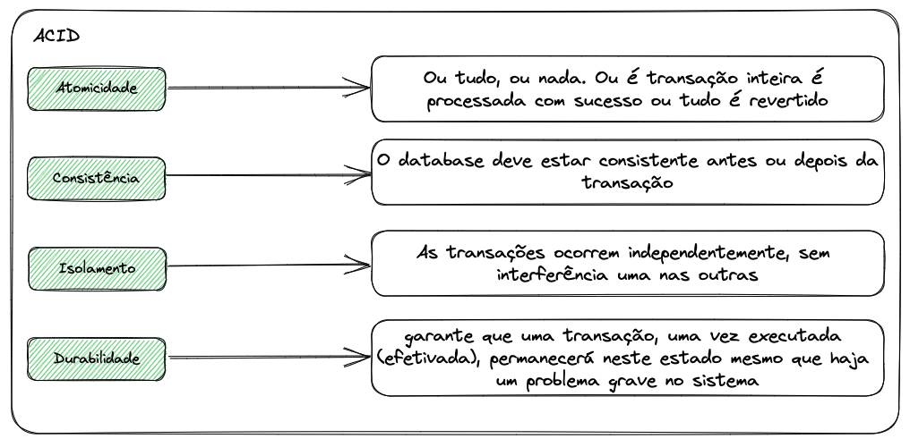
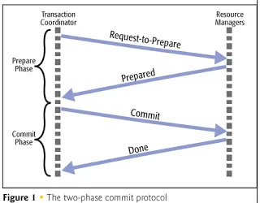
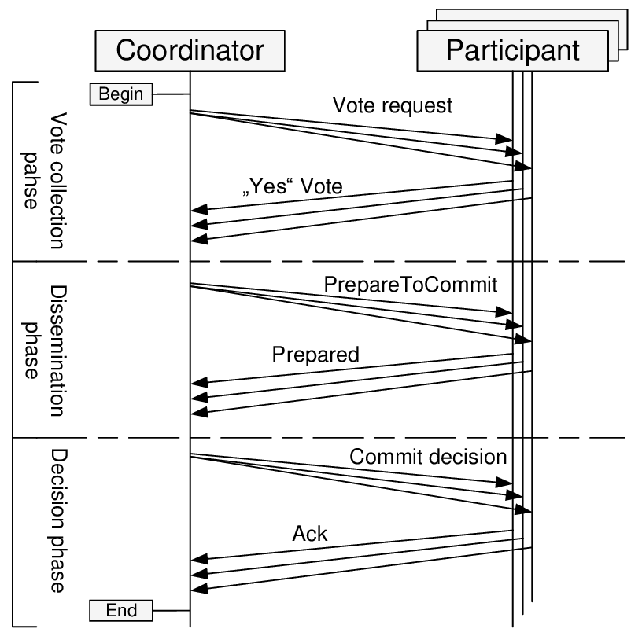

Olá pessoal. Neste artigo, veremos sobre gerenciamento de transações distribuídas em **microsserviços.**

# O que é uma transação?

Uma transação nada mais é do que uma série de ações que devem ser executadas com sucesso. Mesmo que uma das operações falhe, todas as etapas devem ser revertidas para deixar o aplicativo no estado estável anterior. Uma transação tem as seguintes propriedades ACID

## Transações em Monolitos e Microservices

Em um aplicativo monolítico tradicional, haverá um único aplicativo grande conectando-se a um único banco de dados grande e esses aplicativos se apegarão às propriedades ACID.

O limite da transação começa dentro da camada de serviço e pode ser confirmado ou revertido com base no resultado de todas as etapas dessa transação. 

No caso de microsserviços, cada microsserviço executa uma área de negócios específica e mantém o princípio da resposabilidade única (SRP), o que significa que cada microsserviço mantém seu próprio banco de dados. Portanto, as transações são distribuídas.

**Exemplo: vamos considerar um processamento de pedido online para a Arquitetura Monolitica e de Microservices para o cenário abaixo**

- O usuário adiciona um produto a um carrinho em um site de comércio eletrônico e o compra
- Um pedido é criado para o usuário com um número de pedido gerado
- O estoque do item é reduzido em 1, pois o usuário comprou o produto
- Uma fatura é gerada para o item
- O pagamento foi concluído com sucesso
- A fatura é enviada ao usuário por e-mail

Em um monolito, todas as etapas ocorrem dentro de um único aplicativo e um único banco de dados. Todas as etapas são executadas a partir de uma classe de serviço; se qualquer uma das etapas falhar, toda a transação poderá ser revertida.

No caso de um aplicativo de microsserviço, cada uma das etapas acima ocorre individualmente dentro do microsserviço específico e seu banco de dados específico:

* A encomenda será processada no serviço de Encomendas
* Os estoques são verificados e calculados dentro do Serviço de Conta
* A fatura é processada pelo Serviço de faturas
* O pagamento é processado no serviço de pagamento
* O e-mail é acionado pelo serviço de Notificação

Como cada uma das etapas é executada dentro de um microsserviço diferente e seu banco de dados, manter o princípio ACID para toda a transação é extremamente difícil e complicado.

**Porém**, existem alguns padrões padrão para o gerenciamento de transações distribuídas

## Pattern para gerenciamento de transações distribuídas

### Synchronous Patterns
* Two-Phase Commit
* Three Phase Commit

### Asynchronous Patterns

* Padrão Saga baseado em orquestração
* Padrão Saga baseado em coreografia

### Synchronous Patterns

#### Two-Phase Commit (2 PC)
É um protocolo padrão para lidar com transações distribuídas usando 2 estágios, ou seja, o estágio **Prepare** e o estágio **Commit**. Existe um componente coordenador de transações com todos os serviços.

**Cenário de Sucesso**

* O coordenador da transação instrui cada serviço a se preparar para o **commit** e cada serviço verifica se o commit pode ser feito sem nenhum problema.
* Após a verificação, cada serviço envia uma resposta **Prepared** ao coordenador.
* Uma vez que o coordenador recebe todas as resposta **Prepared**, ele diz a todos os serviços para enviar os dados para o banco de dados.
* Agora a transação é bem-sucedida e todas as alterações são confirmadas nos serviços.

**Cenário de Rollback**

* O coordenador da transação instrui cada serviço a se preparar para o **commit** e cada serviço verifica se o commit pode ser feito sem nenhum problema.
* Após a verificação, imagine que um serviço responda com status de falha
* O Coordenador enviará um comando abort para abortar a transação para reverter quaisquer alterações realizadas na transação para manter os princípios ACID

**Desvantagens do 2PC**

* É muito lento porque o coordenador espera por todas as respostas e a transação demora muito para ser confirmada
* Os dados em cada banco de dados são bloqueados até que o comando commit ou abort seja emitido. 
* Esses bloqueios tornarão o sistema lento e causarão uma degradação no desempenho.

#### Three-Phase Commit (3 PC)

Um protocolo de confirmação de duas fases não pode se recuperar de uma falha do coordenador e de um membro da coorte durante a fase de confirmação.

O 3 PC é uma extensão do 2 Phase Commit e a fase de commit é dividida em 2 fases. A confirmação de 3 fases é projetada para tolerância a falhas quando o coordenador ou qualquer outro serviço fica inativo usando a fase de **prepare-to-commit**.

1. Se o coordenador da transação falhar antes de enviar o comando **Prepared** para confirmar para os microsserviços, os outros serviços irão imaginar que a operação foi abortada;
2. O coordenador não enviará uma mensagem **doCommit** para todos os serviços até que eles tenham enviado ACK para **ready-to-commit**
3. Isso garantirá que nenhum dos serviços esteja bloqueado e aguardando outros serviços

**Cenário de Falha**

1. Os estágios de **pre-commit** ajudam o sistema a ser recuperado quando o coordenador ou um serviço ou ambos falham durante a fase de **commit**
2. Quando o novo coordenador de transação assume após o coordenador ter falhado durante a fase de **commit**, ele consulta todos os serviços para ver em que estado eles estão.
3. Se os serviços estiverem na fase de **commit**, o novo coordenador saberá que o coordenador anterior emitiu o comando de **commit** antes de travar
4. Se algum dos serviços não recebeu o comando **prepare-to-commit**, o novo coordenador saberá que o coordenador anterior travou antes mesmo de concluir a fase de **prepare-to-commit**
5. Portanto, pode abortar com segurança a transação

**Desvantagens do Three-Phase Commit**

* O 3 PC deve ser implementado com cuidado para garantir que o particionamento da rede não cause inconsistências na transação.
* 3 PC tem mais sobrecarga, pois envolve mais uma etapa

Embora o commit de duas fases e o commit de três fases funcionem para transações distribuídas em microsserviços, eles não são eficientes, pois são bloqueadores e síncronos por natureza. Um bloqueio por muito tempo se torna um gargalo no sistema.

Todas essas desvantagens abriram caminho para a forma assíncrona usando o padrão **Saga**, que depende da consistência eventual e não mantém a atomicidade.

Porém, neste artigo, vimos o que é uma transação e como ela funciona em monolitos e microservices. Também vimos o que são commits de duas fases e commits de três fases e suas desvantagens.

No próximo artigo, exploraremos padrões baseados em **Saga** que são assíncronos.

Thanks for reading and stay tuned!!!